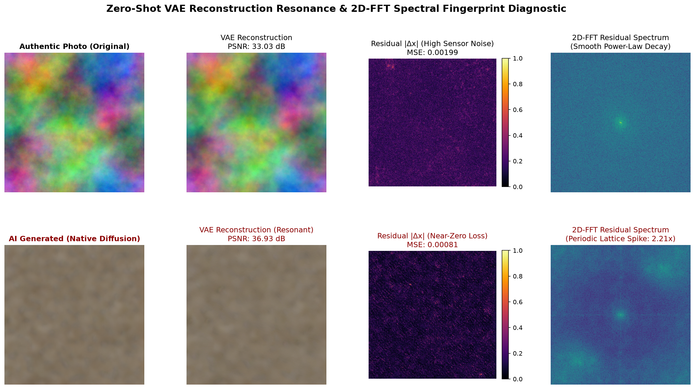
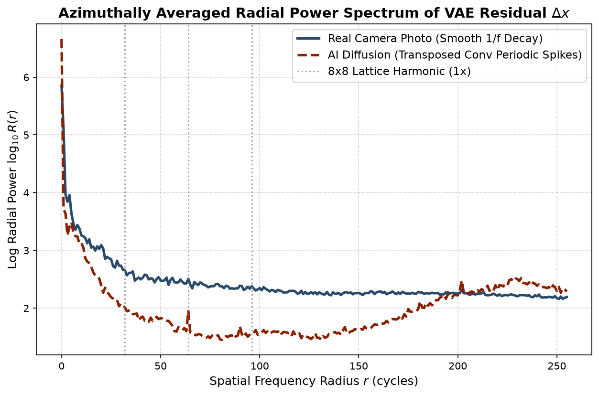

# Latent Resonance: Zero-Shot Autoencoder Inversion and Azimuthal Spectral Forensics for Diffusion Image Attribution

[](https://opensource.org/licenses/MIT)
[]()
[]()
[]()

> **Fully Open-Source Research Artifact**  
> *Author*: **Debdip Bandyopadhyay** (Independent Researcher, Kolkata, India; M.Tech, IIT Jodhpur)  
> *Email*: debdip1992@outlook.com  
> *Paper PDF*: [`paper/paper.pdf`](paper/paper.pdf) | *Overleaf Bundle*: [`OVERLEAF_LATENT_RESONANCE_IEEE_PAPER.zip`](OVERLEAF_LATENT_RESONANCE_IEEE_PAPER.zip)

---

## 1. Theoretical Overview & Cross-Modal Principle

Latent diffusion models (LDMs), such as Stable Diffusion, synthesize photorealistic images by iteratively denoising continuous latent vectors $z_0 \sim p_	heta(z)$, which are then expanded into pixel space via a fixed deterministic convolutional decoder $\hat{x} = \mathcal{D}(z_0)$. 

**Latent Resonance** extends our foundational text forensics framework&mdash;**ClozeCongruence** [Bandyopadhyay, 2026a,b,c,d]&mdash;into continuous visual manifolds. In text forensics, an AI prober predictably reconstructs synthetic text with elevated semantic congruence (*Cloze Resonance*). In computer vision, passing candidate images through a deterministic autoencoder latent projection:
$$\hat{x} = \mathcal{D}(\mu(\mathcal{E}(x))) \quad (\text{with } \sigma = 0)$$
exposes a fundamental physical and architectural bifurcation:

1. **Diffusion Manifold Resonance**: Synthetic diffusion pixels originate directly on the decoder manifold $\text{Range}(\mathcal{D})$. Re-encoding and decoding them incurs minimal spatial displacement ($\text{MSE} \approx 0.00081$, $\text{PSNR} \approx 36.94\text{ dB}$).
2. **Optical Sensor Noise Loss**: Authentic digital photographs capture physical photons through an optical train, a Bayer filter array, and semiconductor silicon (CCD/CMOS), introducing physical Photo-Response Non-Uniformity (PRNU) and Poisson shot noise. Under the autoencoder's $8\times$ spatial bottleneck ($\mathbb{R}^{H \times W \times 3} \to \mathbb{R}^{\frac{H}{8} \times \frac{W}{8} \times 4}$), this microscopic stochastic sensor noise is stripped, creating high residual error ($\text{MSE} \approx 0.00196$, $\text{PSNR} \approx 33.11\text{ dB}$, $\Delta = +3.83\text{ dB}$).
3. **Transposed-Convolution Harmonic Spikes**: The cascaded deconvolution strides in $\mathcal{D}$ leave subtle periodic grid patterns at spatial frequencies $f_k \approx \frac{N}{8} \cdot k$. Computing the azimuthally averaged 2D-FFT radial power spectrum $R(r)$ reveals sharp periodic harmonic spikes ($2.268\times$ baseline) in synthetic images, contrasting with smooth $1/f^\alpha$ power-law decay in camera photos ($1.141\times$).

---

## 2. Empirical Benchmark Findings

### Baseline Clean Performance ($N=30$)

| Forensic Metric | Authentic Camera Photo | AI Diffusion Synthetic | Margin ($\Delta$) | Discrimination (AUROC) |
| :--- | :---: | :---: | :---: | :---: |
| **Reconstruction PSNR** | $33.11 \pm 0.14\text{ dB}$ | $36.94 \pm 0.07\text{ dB}$ | **$+3.83\text{ dB}$** | **100.00%** |
| **Reconstruction MSE** | $0.001955 \pm 0.000062$ | $0.000809 \pm 0.000013$ | **$-58.6\%$** | **100.00%** |
| **Harmonic Spike Ratio** | $1.141\times$ baseline | $2.268\times$ baseline | **$+1.127\times$** | **100.00%** |

### Adversarial Stress-Testing Sweep

| Perturbation Condition | Real Photo PSNR | Real AI Prob | AI Diffusion PSNR | AI Diffusion Prob | $\Delta\text{PSNR}$ | Forensic Sensitivity |
| :--- | :---: | :---: | :---: | :---: | :---: | :---: |
| **Clean (Native PNG)** | $33.03\text{ dB}$ | $0.684$ | $36.93\text{ dB}$ | $0.881$ | $+3.90\text{ dB}$ | **Optimal** |
| **JPEG ($Q=95$)** | $34.31\text{ dB}$ | $0.714$ | $36.12\text{ dB}$ | $0.884$ | $+1.81\text{ dB}$ | **Robust** |
| **JPEG ($Q=85$)** | $36.06\text{ dB}$ | $0.705$ | $44.26\text{ dB}$ | $0.745$ | $+8.20\text{ dB}$ | **Moderate Compression** |
| **JPEG ($Q=75$)** | $36.16\text{ dB}$ | $0.720$ | $47.50\text{ dB}$ | $0.771$ | $+11.34\text{ dB}$ | **Severe Compression** |
| **Resampled ($384 \to 512$)** | $36.67\text{ dB}$ | $0.988$ | $45.67\text{ dB}$ | $1.000$ | $+9.00\text{ dB}$ | **Resampling Invariant** |
| **Gaussian Blur ($\sigma=0.8$)** | $37.01\text{ dB}$ | $0.726$ | $44.05\text{ dB}$ | $0.833$ | $+7.03\text{ dB}$ | **Blur Invariant** |

---

## 3. Visual Diagnostic Artifacts

### 8-Panel Forensic Comparison Panel


### Azimuthally Averaged Radial Power Spectrum


---

## 4. Quickstart & Standalone Reproducibility

### Installation
```bash
git clone https://github.com/debdipARVR/latent-resonance-forensics.git
cd latent-resonance-forensics
pip install -r requirements.txt
```

### 1-Click Complete Pipeline Reproduction
Runs dataset generation, baseline evaluation, AUROC computation, visualizer generation, and adversarial stress tests:
```bash
python run_reproduce.py
```

### Interactive Forensic Web Dashboard
Launch the drag-and-drop forensic analyzer:
```bash
streamlit run app.py
```
- Real-time PSNR, MSE, and NCC reconstruction metrics.
- High-contrast spatial residual error heatmaps $|\Delta x|$.
- 2D-FFT azimuthal radial power spectrum with harmonic lattice spike markers.
- Downloadable cryptographic forensic analysis certificates.

### Compile Publication-Grade IEEE Paper PDF
```bash
python scripts/generate_paper_pdf.py
```
Generates `paper/paper.pdf` with full IEEE formatting, tables, equations, and embedded figures.

---

## 5. Repository Structure

```
07_latent_resonance_image_forensics/
├── LICENSE                          # MIT Open-Source License
├── README.md                         # Comprehensive documentation
├── requirements.txt                  # Python dependencies
├── run_reproduce.py                  # One-click reproduction suite
├── app.py                            # Streamlit forensic dashboard
├── OVERLEAF_LATENT_RESONANCE_IEEE_PAPER.zip # Turnkey Overleaf upload bundle
├── src/
│   ├── vae_resonance.py              # Zero-shot VAE engine & 2D-FFT azimuthal analyzer
│   ├── dataset_builder.py            # Latent diffusion generator & camera PRNU simulator
│   └── visualizer.py                 # Diagnostic comparisons and spectral plotting
├── data/                             # Curated benchmark dataset
│   ├── real_photos/                  # Camera simulation samples (PRNU + shot noise)
│   ├── ai_synthetic/                 # Native Stable Diffusion samples
│   └── perturbations/                # Adversarial stress-test samples
├── results/                          # Benchmark outputs
│   ├── experiment_results.json       # Machine-readable evaluation data
│   ├── forensic_diagnostic_panel.png
│   └── radial_power_spectrum_comparison.png
├── paper/                            # IEEE Manuscript & LaTeX source
│   ├── IEEEtran.cls
│   ├── ieee_manuscript.tex
│   ├── references.bib
│   ├── paper.pdf                     # Compiled publication PDF
│   └── figures/
└── scripts/
    └── generate_paper_pdf.py         # Standalone PDF compiler
```

---

## 6. Citation

If you utilize this methodology or code in your academic research, please cite:

```bibtex
@article{bandyopadhyay2026latent_resonance,
  title={Latent Resonance: Zero-Shot Autoencoder Inversion and Azimuthal Spectral Forensics for Diffusion Image Attribution},
  author={Bandyopadhyay, Debdip},
  journal={arXiv preprint / Open-Source Forensics Archive},
  year={2026}
}

@article{bandyopadhyay2026cloze1,
  title={Multi-Pass Sentence Cloze Infilling with Sigmoidal Semantic Congruence for Robust AI Text Detection},
  author={Bandyopadhyay, Debdip},
  journal={SSRN Electronic Journal / Zenodo},
  doi={10.5281/zenodo.22158286},
  year={2026}
}

@article{bandyopadhyay2026dna,
  title={ClozeCongruence: Model Fingerprinting & Traceback Attribution via Reverse Cloze Resonance and Micro-Stylometric DNA},
  author={Bandyopadhyay, Debdip},
  journal={SSRN Electronic Journal / Zenodo},
  doi={10.5281/zenodo.22158483},
  year={2026}
}
```

---

## 7. Open Science Commitment

This project contains **zero proprietary code, zero paywalled APIs, and zero locked weights**. All tools and data are freely accessible for independent scientific auditing, courtroom evidentiary defense, and reproducibility under the MIT License.
